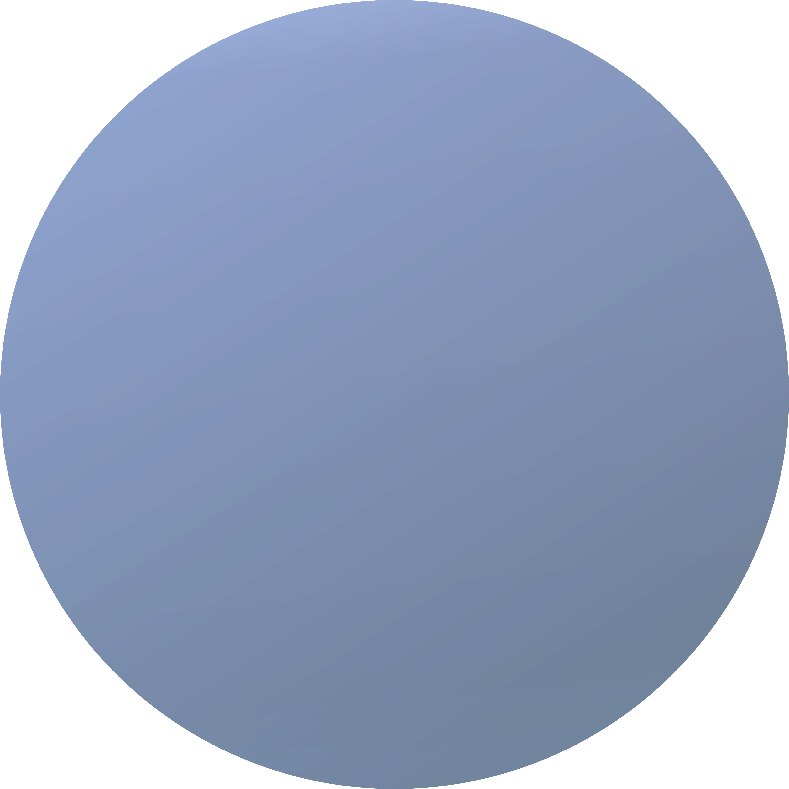

<div align="center">
    <h1>Neptune</h1>
</div>

<p align="center">
 
</p>

 


> This engine is still under development and lacks significant features. It is currently more of an abstraction layer than an engine.

A header-only low-level 3D game engine programmed and programmable in C++. No fancy gui or interface, just C/C++ and a text editor.

## Prerequisites

To use this engine, it's recommended to have:
 - Basic/Intermediate C++ programming knowledge
 - Basic/Intermediate graphical programming knowledge

## Dependencies
 - git
     - Recommended to clone the repo
 - C/C++ Compiler (gcc, clang, etc.)
     - Needed to compile the code
 - CMake
     - An alternative method of compiling
    

## Getting Started

To use Neptune, you need to git clone this repository.

```
git clone https://github.com/KoiFish0/neptune-engine.git ./project-name
```

From here, you can put your code in the src/ directory. You can use the included main.cpp file as a sample file. Anything in the src/ directory contains a "game" developed using Neptune. It is used for testing the engine but can also be used a sample "game".

## Documentation

Currently, there is no proper documentation, however, the comments in my code should serve as adequate documentation of the engine in the mean time. 

> [!NOTE] 
> This engine has only been verified to work on Linux.

## Mentions

This project would not have been possible without these resources:

 - https://learnopengl.com/
 - https://www.learncpp.com/
 - https://docs.gl/

